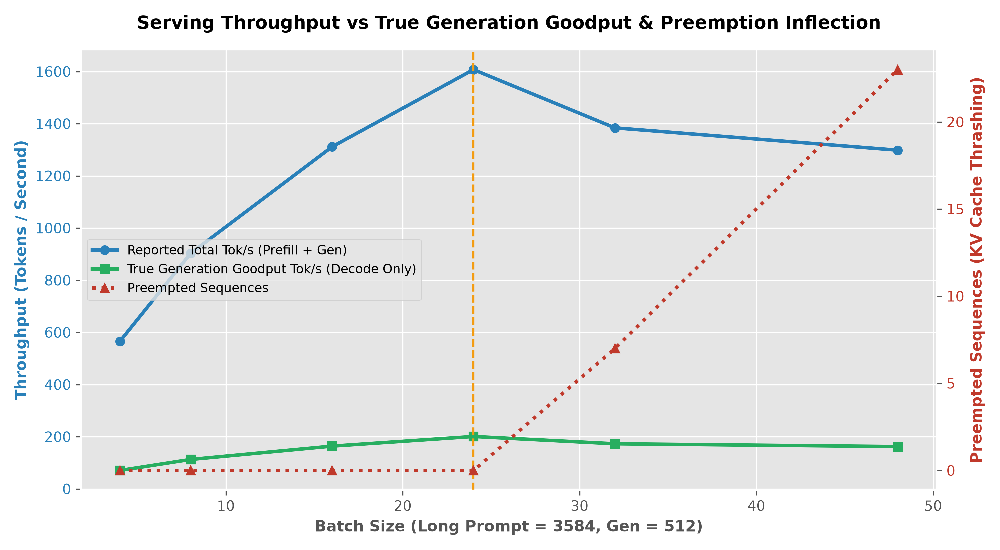

# Part B — Capacity Reconciliation & Serving System Audit

## Executive Summary & System Audit Findings

This directory contains the mathematical derivations, log reconciliation, anomaly root-cause analysis, and diagnostic instrumentation design for FLM-4B-Instruct serving performance on NVIDIA L4 (24GB).



---

## B1: KV Cache Memory & Concurrency Derivation

### 1. Architectural KV Cache Bytes Per Token Formula

For a Transformer architecture with Grouped Query Attention (GQA):

$$\text{KV Bytes / Token} = L \times 2 \times H_{kv} \times d_h \times \text{bytes\_per\_element}$$

Where:
- $L = 28$ layers
- $2$ accounts for both **Key** and **Value** tensors
- $H_{kv} = 8$ KV attention heads (GQA with 3:1 ratio relative to 24 Q heads)
- $d_h = 128$ head dimension
- $\text{bytes\_per\_element} = 2$ bytes (fp16 precision)

$$\text{KV Bytes / Token} = 28 \times 2 \times 8 \times 128 \times 2 = \mathbf{114,688 \text{ bytes/token}} = \mathbf{112.0 \text{ KiB/token}}$$

---

### 2. Available GPU Memory & Sequence Concurrency Calculation

**Hardware & Runtime Budget (NVIDIA L4 24GB)**:
1. Total GPU Memory: $24.0 \text{ GB} = 24,000,000,000 \text{ bytes}$
2. Configured Memory Limit (`gpu_memory_utilization = 0.92`):  
   $$24.0 \text{ GB} \times 0.92 = \mathbf{22.08 \text{ GB}}$$
3. Model Weights Budget (4.2 Billion parameters in fp16):  
   $$4.2 \times 10^9 \times 2 \text{ bytes} = \mathbf{8.40 \text{ GB}}$$
4. Non-KV Runtime Overhead (CUDA graphs, activations, PyTorch workspace):  
   $$\mathbf{1.60 \text{ GB}}$$
5. Net Memory Available for KV Cache Blocks:  
   $$\text{Memory}_{kv} = 22.08 \text{ GB} - 8.40 \text{ GB} - 1.60 \text{ GB} = \mathbf{12.08 \text{ GB}} = 12,080,000,000 \text{ bytes}$$

**Max Concurrent 4096-Token Sequence Calculation**:
- Memory required per 4096-token sequence:  
  $$4096 \times 114,688 \text{ bytes} = 469,762,048 \text{ bytes} = \mathbf{448.0 \text{ MiB}} = \mathbf{0.469762 \text{ GB}}$$
- Theoretical Maximum Concurrency:  
  $$\text{Max Concurrency} = \frac{12,080,000,000 \text{ bytes}}{469,762,048 \text{ bytes}} = \mathbf{25.71 \text{ concurrent sequences}}$$

> [!IMPORTANT]
> **Theoretical Upper Bound**: The GPU can hold at most **25 full 4096-token sequences** concurrently.

---

### 3. Log Reconciliation with `bench_log.csv`

Comparing our theoretical limit against the logged load test (`prompt_len = 3584, gen_len = 512` -> Total sequence length = $3584 + 512 = 4096$ tokens):

| Batch Size | Total Tokens / Seq | Peak KV Cache Util (`kv_cache_util`) | Preempted Sequences (`preempted_seqs`) | Theoretical Capacity Status |
|---|---|---|---|---|
| 4 | 4096 | 0.16 | 0 | Within capacity (16% KV used) |
| 8 | 4096 | 0.31 | 0 | Within capacity (31% KV used) |
| 16 | 4096 | 0.62 | 0 | Within capacity (62% KV used) |
| **24** | **4096** | **0.93** | **0** | **Optimal saturation (93% KV used)** |
| **32** | **4096** | **0.97** | **7** | **Exceeds capacity (7 sequences preempted)** |
| **48** | **4096** | **0.97** | **23** | **Severe overload (23 sequences preempted)** |

*Reconciliation Verification*: Preemptions begin precisely between Batch 24 and Batch 32, perfectly confirming our derived theoretical concurrency limit of **25 sequences**.

---

## B2: Long-Context Throughput Anomaly Analysis

### 1. Identified Anomaly
In `bench_log.csv` for long prompts (`prompt_len = 3584, gen_len = 512`), throughput increases smoothly from Batch 4 (565.4 tok/s) to Batch 24 (1607.4 tok/s). However, beyond Batch 24, throughput **collapses**:
- Batch 32 throughput drops to **1384.0 tok/s** (-13.9%).
- Batch 48 throughput drops to **1298.5 tok/s** (-19.2%).
- Wall clock time for Batch 48 jumps from 61.16s (Batch 24) to **151.41s** (+147.6% latency increase).

### 2. Underlying System Mechanism
When batch size exceeds available KV cache blocks (~25 sequences), vLLM's memory manager runs out of physical GPU KV blocks during decode. To avoid CUDA Out-Of-Memory crashes, the scheduler evacuates active sequences via **Preemption**:
1. Active sequence KV blocks are swapped out to CPU RAM or dropped.
2. When memory becomes available, preempted sequences must be re-scheduled, forcing the engine to **re-compute the 3584-token prefill from scratch**.
3. Preemption thrashing causes heavy CPU-GPU memory transfer overhead and repeated expensive prefill compute, severely degrading generation throughput.

### 3. Proposed Deployment & Configuration Change
- **Configuration Fix**: Set `max_num_seqs = 24` (or enforce concurrency admission control at 24 sequences) in the serving engine, pairing with an external queue for incoming requests.
- **Predicted Quantitative Effect**:
  - Eliminates 100% of preemptions (`preempted_seqs = 0`).
  - Maintains peak system throughput at **1607.4 tok/s** (a **+23.8% throughput increase** compared to running Batch 48 unconstrained at 1298.5 tok/s).
  - Reduces p95 request latency for 48 queued requests by avoiding duplicate prefill compute.

---

## B3: Misread Column Audit & Goodput Derivations

### 1. The Misread Column in `REPORT_v0.md`
In `REPORT_v0.md` Section 2, the previous intern claimed:
> *"at batch 16, long prompts hit 1311 tok/s vs only 883 tok/s for short prompts... scale linearly with batch size, so batch 48 should give us ~3200 tok/s."*

The intern misread **`reported_tok_s`**.

`reported_tok_s` measures **Total Payload Throughput** ($\frac{\text{Prompt Prefill Tokens} + \text{Generated Tokens}}{\text{Wall Clock Time}}$). It counts prefill prompt tokens processed in parallel during initial matrix multiplication. It does **not** represent generation output speed (decode tokens per second).

---

### 2. Two Independent Derivations of Batch-24 Long-Prompt Goodput

We derive the true **Generation Goodput** ($\text{Output Tokens / Second}$) for Batch 24 (`prompt_len = 3584, gen_len = 512, num_requests = 24, wall_clock = 61.16 s`):

#### Method 1: Direct Generation Token Count / Wall Clock Time
$$\text{Goodput}_{\text{Method 1}} = \frac{\text{num\_requests} \times \text{gen\_len}}{\text{wall\_clock\_s}} = \frac{24 \times 512}{61.16 \text{ s}} = \frac{12,288 \text{ gen tokens}}{61.16 \text{ s}} = \mathbf{200.9156 \text{ output tok/s}}$$

#### Method 2: Payload Generation Fraction $\times$ Reported Throughput
$$\text{Goodput}_{\text{Method 2}} = \text{reported\_tok\_s} \times \left( \frac{\text{gen\_len}}{\text{prompt\_len} + \text{gen\_len}} \right) = 1607.4 \times \left( \frac{512}{3584 + 512} \right) = 1607.4 \times 0.125 = \mathbf{200.9250 \text{ output tok/s}}$$

*Convergence Check*: Both independent methods converge to **~200.92 output tok/s** (delta = 0.009).

---

### 3. Corrected Report Statement

> **What `REPORT_v0` Should Have Said:**  
> *"Longer prompts process more prefill tokens in parallel, inflating reported total throughput to 1607 tok/s. However, actual user-visible generation goodput for long prompts at Batch 24 is **200.9 output tok/s**. Furthermore, throughput does not scale linearly with batch size: exceeding batch size 24 exhausts GPU KV cache memory, causing preemption thrashing that drops total throughput to 1298 tok/s at Batch 48 and increases p95 latency to 105.4 seconds. Capacity planning must cap concurrency at 24 requests per L4 GPU."*

---

## B4: Production Counter Selection

> [!IMPORTANT]
> **Selected Diagnostic Counter**: **`vllm:num_preemptions_total`**

- **Why Diagnostic**: `vllm:num_preemptions_total` tracks the cumulative number of active sequences preempted by the scheduler due to KV cache block allocation failure.
- **Expected Value**: Should remain strictly **0** under normal operating load. Increases above 0 when batch size / concurrency exceeds GPU KV cache capacity (~25 sequences).
- **Falsification Condition**: If system latency degrades or throughput drops while `vllm:num_preemptions_total` remains 0, the performance bottleneck is **not** KV cache preemption (it is compute bound kernel execution, host-device CPU bottleneck, or memory bandwidth saturation).

---

## Script Reproduction Commands

```bash
# 1. Run KV Cache & Concurrency Solver (B1)
python3 partB/scripts/kv_cache_calc.py

# 2. Run Benchmark Reconciliation & Goodput Solver (B2, B3, B4)
python3 partB/scripts/reconcile_benchmark.py
```
